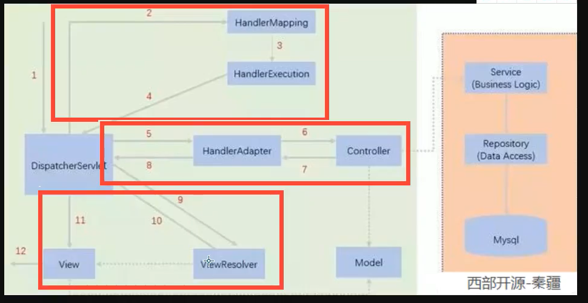

## Spring MVC

* 1、轻量级，简单易学
* 2、高效，基于请求响应的MVC框架
* 3、与Spring兼容性好，无缝结合
* 4、约定优于配置
* 5、功能强大：RESTful、数据验证、格式化、本地化、主题等
* 6、简洁灵活

**Spring的web框架围绕DispatcherServlet设计。DispatcherServlet的作用是将请求分发到不同的处理器。**

#### SpringMVC的原理

1.用户发起请求的时候，他会经过一个前端控制器DispatcherServlet
2.根据这个请求找到他的映射器，HandlerMapping
3.然后把映射器返回回来，HandlerExecution
4.根据这个映射器再去适配映射器，HandlerAdapter
5.适配到的映射器就是一个Controller，然后执行Controller
6.执行完会返回一个ModelAndView
7.通过ModelAndView去配置具体的视图解释器
8.视图解析器返回给前端调用，就是具体的要展示的那个页面



## SpringMVC开发

### bean开发

重新编写web.xml文件

```xml
<?xml version="1.0" encoding="UTF-8"?>
<web-app xmlns="http://xmlns.jcp.org/xml/ns/javaee"
         xmlns:xsi="http://www.w3.org/2001/XMLSchema-instance"
         xsi:schemaLocation="http://xmlns.jcp.org/xml/ns/javaee http://xmlns.jcp.org/xml/ns/javaee/web-app_4_0.xsd"
         version="4.0">
    <!--配置DispatcherServlet:这个是SpringMVC的核心，请求分发器，前端控制器-->
    <servlet>
        <servlet-name>springmvc</servlet-name>
        <servlet-class>org.springframework.web.servlet.DispatcherServlet</servlet-class>
        <!--DispatcherServlet要绑定Spring-MVC的配置文件-->
        <init-param>
            <param-name>contextConfigLocation</param-name>
            <param-value>classpath:springmvc-servlet.xml</param-value>
        </init-param>
        <!--启动级别1-->
        <load-on-startup>1</load-on-startup>
    </servlet>
    <servlet-mapping>
        <servlet-name>springmvc</servlet-name>
        <url-pattern>/</url-pattern>
    </servlet-mapping>
</web-app>
```

编写springmvc-servlet.xml文件

```xml
<?xml version="1.0" encoding="UTF-8"?>
<beans xmlns="http://www.springframework.org/schema/beans"
       xmlns:xsi="http://www.w3.org/2001/XMLSchema-instance"
       xsi:schemaLocation="
        http://www.springframework.org/schema/beans
        http://www.springframework.org/schema/beans/spring-beans-4.2.xsd">

    <!--处理器映射器-->
    <bean class="org.springframework.web.servlet.handler.BeanNameUrlHandlerMapping"/>
    <!--处理器适配器-->
    <bean class="org.springframework.web.servlet.mvc.SimpleControllerHandlerAdapter"/>
    <!--视图解析器-->
    <bean class="org.springframework.web.servlet.view.InternalResourceViewResolver" id="internalResourceViewResolver">
        <!--前缀-->
        <property name="prefix" value="/WEB-INF/jsp/"/>
        <!--后缀-->
        <property name="suffix" value=".jsp"/>
    </bean>
</beans>
```

然后编写方法HelloController

```java
package com.gao.controller;
import org.springframework.web.servlet.ModelAndView;
import org.springframework.web.servlet.mvc.Controller;
import javax.servlet.http.HttpServletRequest;
import javax.servlet.http.HttpServletResponse;
public class HelloController implements Controller {
    public ModelAndView handleRequest(HttpServletRequest request, HttpServletResponse response) throws Exception{
        // ModelAndView 模型和视图
        ModelAndView mv = new ModelAndView();
        // 封装对象，放在ModelAndView中，Model
        mv.addObject("msg","HelloSpringMVC");
        // 封装要跳转的视图，放在ModelAndView中
        mv.setViewName("hello");
        return mv;
    }
}
```

然后把这个注册到bean中

```xml
<bean id="/hellos" class="com.gao.controller.HelloController"/>
```

然后启动猫测试即可

### 注解开发

web.xml文件不变

资源文件

```xml
<?xml version="1.0" encoding="UTF-8"?>
<beans xmlns="http://www.springframework.org/schema/beans"
       xmlns:xsi="http://www.w3.org/2001/XMLSchema-instance"
       xmlns:context="http://www.springframework.org/schema/context"
       xmlns:mvc="http://www.springframework.org/schema/mvc"
       xsi:schemaLocation="
        http://www.springframework.org/schema/beans
        http://www.springframework.org/schema/beans/spring-beans-4.2.xsd
        http://www.springframework.org/schema/context
        http://www.springframework.org/schema/context/spring-context-4.2.xsd
        http://www.springframework.org/schema/mvc
        http://www.springframework.org/schema/mvc/spring-mvc-4.2.xsd">
    <!--自动扫描包-->
    <context:component-scan base-package="com.gao.controller"/>
    <!--让Spring MVC不处理静态资源 .css .js .html .mp3 .mp4-->
    <mvc:default-servlet-handler/>

    <mvc:annotation-driven/>
    <!--视图解析器-->
    <bean class="org.springframework.web.servlet.view.InternalResourceViewResolver" id="internalResourceViewResolver">
        <!--前缀-->
        <property name="prefix" value="/WEB-INF/jsp/"/>
        <!--后缀-->
        <property name="suffix" value=".jsp"/>
    </bean>

</beans>
```

然后编写方法

```java
package com.gao.controller;

import org.springframework.stereotype.Controller;
import org.springframework.ui.Model;
import org.springframework.web.bind.annotation.RequestMapping;

@Controller
//@RequestMapping("/hello")
public class HelloController {
    // localhost:8080/hello/h1
    @RequestMapping("/h1")
    public String hello(Model model){
        // 封装数据
        model.addAttribute("msg","HelloSpringMVC");
        return "hello"; // 会被视图解释器处理
    }
}
```

@RequestMapping注解用于映射url到控制器类或是一个特定的处理程序的方法，可用于类或者方法上

如果在类上和方法上都写了就需要先访问类的路径，在访问方法的路径

## RestFul风格

概念：RestFul就是一个资源定位及资源操作的风格，不是标准也不是协议，只是一种风格，基于这个风格设计的软件更加简洁，更有层次，更易于实现缓存等机制 

要映射参数的话需要加上

```java
@GetMapping("/add/{a}/{b}")
public String test(@PathVariable int a,@PathVariable int b, Model model){
    int res = a + b;
    model.addAttribute("msg","结果为" + res);
    return "hello";
}
```

```java
//    @RequestMapping(value = "/add/{a}/{b}",method = RequestMethod.GET)
@GetMapping
@PostMapping
@PutMapping
@DeleteMapping
@PatchMapping
```

## 转发和重定向

### 转发

着实现了一个转发

```java
package com.gao.controller;

import org.springframework.stereotype.Controller;
import org.springframework.ui.Model;
import org.springframework.web.bind.annotation.RequestMapping;

@Controller
public class ModelTest1 {
@RequestMapping("/m1/t1")
public String test(Model model){
    // 转发
    model.addAttribute("msg","ModelTest");
    return "/WEB-INF/jsp/hello.jsp";
}
}
```

当然也可以使用另外一种常见的

```java
package com.gao.controller;

import org.springframework.stereotype.Controller;
import org.springframework.ui.Model;
import org.springframework.web.bind.annotation.RequestMapping;

@Controller
public class ModelTest1 {
@RequestMapping("/m1/t1")
public String test(Model model){
    // 转发
    model.addAttribute("msg","ModelTest");
    return "forwart:/WEB-INF/jsp/hello.jsp";
}
}
```

上面的两种情况都是没有视图解释器的情况

如果有的话，也是只需要返回名字就可以

### 重定向

重定向不需要视图解析器，本身就是跳转页面，所以只需要注意路径 问题

```java
package com.gao.controller;

import org.springframework.stereotype.Controller;
import org.springframework.ui.Model;
import org.springframework.web.bind.annotation.RequestMapping;

@Controller
public class ModelTest1 {
    @RequestMapping("/m1/t1")
    public String test(Model model){
        // 重定向
        model.addAttribute("msg","ModelTest");
        return "redirect:/index.jsp";
    }
}
```

## 接收数据

无论参数名是不是一样，都建议写上@RequestParam，因为他可以一看让你看出他是传递前端的参数

```java
package com.gao.controller;

import org.springframework.stereotype.Controller;
import org.springframework.ui.Model;
import org.springframework.web.bind.annotation.GetMapping;
import org.springframework.web.bind.annotation.RequestMapping;
import org.springframework.web.bind.annotation.RequestParam;

@Controller
@RequestMapping("/user")
public class UserController {
    @GetMapping("/t1")
    public String test1(@RequestParam("username") String name, Model model){
        // 接受前端的参数
        System.out.println(name);
        // 将得到的参数传递给前端
        model.addAttribute("msg",name);
        return "hello";
    }
}
```

传递对象

```java
package com.gao.pojo;

import lombok.Data;

@Data
public class User {
    private int id;
    private String name;
    private int age;
}
```

```java
// 接受的是一个对象
@GetMapping("/t2")
public String tset2(User user){
    System.out.println(user);
    return "hello";
}
```

传递对象时，参数名必须和属性名一样，不然接收到的数据就是null

http://localhost:8080/user/t2?id=3&name=高世伟&age=18)

## 乱码问题

Spring自带的过滤器解决

```xml
<!--配置乱码过滤-->
<filter>
    <filter-name>encoidng</filter-name>
    <filter-class>org.springframework.web.filter.CharacterEncodingFilter</filter-class>
    <init-param>
        <param-name>encoding</param-name>
        <param-value>utf-8</param-value>
    </init-param>
</filter>
<filter-mapping>
    <filter-name>encoidng</filter-name>
    <url-pattern>/*</url-pattern>
</filter-mapping>
```

也可以自己写一个过滤器

## JSON

什么是json？

* 是一种轻量级的数据交换格式
* 采用完全独立于编程语言的文本格式来存储和表示数据
* 简洁和清晰的层次结构是的JSON成为理想的数据交换语言
* 易与人阅读和编写，用时也易于机器解析和生成，并有效的提升网络传输效率

```html
<script type="text/javascript">
    var user = {
        name : "高世伟",
        age : 18
    }
    // 将js对象转换为json对象
    var test = JSON.stringify(user)
    console.log(test)
    // 将json对象转换为js对象
    var obj = JSON.parse(test)
    console.log(obj)
</script>
```

有一个插件可以使用

```xml
<dependency>
    <groupId>com.fasterxml.jackson.core</groupId>
    <artifactId>jackson-databind</artifactId>
    <version>2.11.0</version>
</dependency>
```

测试

```java
@Controller
public class UserController {
    @RequestMapping("/t1")
    @ResponseBody // 他就不会走视图解析器，直接找页面
    public String json() throws JsonProcessingException {
        // jackson
        ObjectMapper mapper = new ObjectMapper();
        User user = new User("高世伟",20,"男");
        String string = mapper.writeValueAsString(user);
        return string;
    }
}
```

对于json乱码，只需要在配置文件中写入

```xml
<!--JSON乱码-->
<mvc:annotation-driven>
    <mvc:message-converters>
        <bean class="org.springframework.http.converter.StringHttpMessageConverter">
            <constructor-arg value="utf-8"/>
        </bean>
        <bean class="org.springframework.http.converter.json.MappingJackson2HttpMessageConverter">
            <property name="objectMapper">
                <bean class="org.springframework.http.converter.json.Jackson2ObjectMapperFactoryBean">
                    <property name="failOnEmptyBeans" value="false"/>
                </bean>
            </property>
        </bean>
    </mvc:message-converters>
</mvc:annotation-driven>
```

即可。

```java
@Controller 这个会找视图解析器
@RestController 这个不会找视图解析器，直接返回字符串
```

也可以写一个工具包，以后方便使用

```java
public class JsonUtils {
    public static String getJson(Object object){
        return getJson(object,"yyyy-MM-dd HH:mm:ss");
    }
    public static String getJson(Object object,String dateFormat){
        ObjectMapper mapper = new ObjectMapper();
        // 不使用时间戳的方式
        mapper.configure(SerializationFeature.WRITE_DATE_KEYS_AS_TIMESTAMPS,false);
        // 自定义时间戳格式
        SimpleDateFormat simpleDateFormat = new SimpleDateFormat(dateFormat);
        mapper.setDateFormat(simpleDateFormat);
        try {
            return mapper.writeValueAsString(object);
        } catch (JsonProcessingException e) {
            e.printStackTrace();
        }
        return null;
    }
}
```

当然，上面这里面其实就是一个思想，重载，如果穿两个参数就走下面的，穿一个参数，就走上面的，而上面的调用了下面的。这个需要在写代码的时候多加磨练思想。

```java
@RequestMapping("/j3")
public String json3(){
    Date date = new Date();
    return JsonUtils.getJson(date, "yyyy-MM-dd HH:mm:ss");
}
```

## 关于整合ssm

在整合ssm的时候，找了三天问题，目前我发现的问题就是spring-mvcweb版本的问题，idea有时候有只找一个依赖，也就是只对哪一个版本有效，我目前还没有找到好的解决办法，我使用的就是直接的maven的依赖换个地方，让他重新下载。

下面开始用正确的方式打开ssm

导包，这些都是测试好的，可以使用

```xml
<dependencies>
    <dependency>
        <groupId>org.projectlombok</groupId>
        <artifactId>lombok</artifactId>
        <version>1.18.4</version>
    </dependency>
    <!--Junit-->
    <dependency>
        <groupId>junit</groupId>
        <artifactId>junit</artifactId>
        <version>4.12</version>
    </dependency>
    <!--数据库驱动-->
    <dependency>
        <groupId>mysql</groupId>
        <artifactId>mysql-connector-java</artifactId>
        <version>5.1.47</version>
    </dependency>
    <!-- 数据库连接池 -->
    <dependency>
        <groupId>com.mchange</groupId>
        <artifactId>c3p0</artifactId>
        <version>0.9.5.2</version>
    </dependency>

    <!--Servlet - JSP -->
    <dependency>
        <groupId>javax.servlet</groupId>
        <artifactId>servlet-api</artifactId>
        <version>2.5</version>
    </dependency>
    <dependency>
        <groupId>javax.servlet.jsp</groupId>
        <artifactId>jsp-api</artifactId>
        <version>2.2</version>
    </dependency>
    <dependency>
        <groupId>javax.servlet</groupId>
        <artifactId>jstl</artifactId>
        <version>1.2</version>
    </dependency>

    <!--Mybatis-->
    <dependency>
        <groupId>org.mybatis</groupId>
        <artifactId>mybatis</artifactId>
        <version>3.5.2</version>
    </dependency>
    <dependency>
        <groupId>org.mybatis</groupId>
        <artifactId>mybatis-spring</artifactId>
        <version>2.0.2</version>
    </dependency>

    <!--Spring-->
    <dependency>
        <groupId>org.springframework</groupId>
        <artifactId>spring-webmvc</artifactId>
        <version>5.1.9.RELEASE</version>
    </dependency>
    <dependency>
        <groupId>org.springframework</groupId>
        <artifactId>spring-jdbc</artifactId>
        <version>5.1.9.RELEASE</version>
    </dependency>
</dependencies>
<build>
    <resources>
        <resource>
            <directory>src/main/java</directory>
            <includes>
                <include>**/*.properties</include>
                <include>**/*.xml</include>
            </includes>
            <filtering>false</filtering>
        </resource>
        <resource>
            <directory>src/main/resources</directory>
            <includes>
                <include>**/*.properties</include>
                <include>**/*.xml</include>
            </includes>
            <filtering>false</filtering>
        </resource>
    </resources>
</build>
```

1、新建applicationContext.xml

```xml
<?xml version="1.0" encoding="UTF-8"?>
<beans xmlns="http://www.springframework.org/schema/beans"
       xmlns:xsi="http://www.w3.org/2001/XMLSchema-instance"
       xsi:schemaLocation="http://www.springframework.org/schema/beans
       http://www.springframework.org/schema/beans/spring-beans.xsd">
</beans>
```

2、新建mybatis-config.xml文件

```xml
<?xml version="1.0" encoding="UTF-8" ?>
<!DOCTYPE configuration
        PUBLIC "-//mybatis.org//DTD Config 3.0//EN"
        "http://mybatis.org/dtd/mybatis-3-config.dtd">
<configuration>
</configuration>
```

### Mybatis层编写

数据库配置文件 **database.properties**

```properties
jdbc.driver=com.mysql.jdbc.Driver
jdbc.url=jdbc:mysql://localhost:3306/student?useSSL=true&useUnicode=true&characterEncoding=utf8
jdbc.username=root
jdbc.password=
```

IDEA关联数据库

编写MyBatis的核心配置文件

```xml
<?xml version="1.0" encoding="UTF-8" ?>
<!DOCTYPE configuration
        PUBLIC "-//mybatis.org//DTD Config 3.0//EN"
        "http://mybatis.org/dtd/mybatis-3-config.dtd">
<configuration>
    <typeAliases>
        <package name="com.gao.pojo"/>
    </typeAliases>

    <mappers>
        <mapper class="com.gao.dao.BookMapper"/>
    </mappers>
</configuration>
```

编写数据库对应的实体类 com.kuang.pojo.Books

```java
@Data
@AllArgsConstructor
@NoArgsConstructor
public class Books {
    private int bookID;
    private String bookName;
    private int bookCounts;
    private String detail;
}
```

编写Dao层的 Mapper接口！

```java
package com.gao.dao;

import com.gao.pojo.Books;

import java.util.List;

public interface BookMapper {
    //增加一个Book
    int addBook(Books book);

    //根据id删除一个Book
    int deleteBookById(int id);

    //更新Book
    int updateBook(Books books);

    //根据id查询,返回一个Book
    Books queryBookById(int id);

    //查询全部Book,返回list集合
    List<Books> queryAllBook();
}
```

编写接口对应的 Mapper.xml 文件。需要导入MyBatis的包；

```xml
<?xml version="1.0" encoding="UTF-8" ?>
<!DOCTYPE mapper
        PUBLIC "-//mybatis.org//DTD Mapper 3.0//EN"
        "http://mybatis.org/dtd/mybatis-3-mapper.dtd">

<mapper namespace="com.gao.dao.BookMapper">

    <!--增加一个Book-->
    <insert id="addBook" parameterType="Books">
        insert into student.books(bookName,bookCounts,detail)
        values (#{bookName}, #{bookCounts}, #{detail})
    </insert>

    <!--根据id删除一个Book-->
    <delete id="deleteBookById" parameterType="int">
        delete from student.books where bookID=#{bookID}
    </delete>

    <!--更新Book-->
    <update id="updateBook" parameterType="Books">
        update student.books
        set bookName = #{bookName},bookCounts = #{bookCounts},detail = #{detail}
        where bookID = #{bookID}
    </update>

    <!--根据id查询,返回一个Book-->
    <select id="queryBookById" resultType="Books">
        select * from student.books
        where bookID = #{bookID}
    </select>

    <!--查询全部Book-->
    <select id="queryAllBook" resultType="Books">
        SELECT * from student.books
    </select>

</mapper>
```

编写Service层的接口和实现类

```java
public interface BookService {
    //增加一个Book
    int addBook(Books book);
    //根据id删除一个Book
    int deleteBookById(int id);
    //更新Book
    int updateBook(Books books);
    //根据id查询,返回一个Book
    Books queryBookById(int id);
    //查询全部Book,返回list集合
    List<Books> queryAllBook();
}
```

编写service实现类

```java
package com.gao.service;

import com.gao.dao.BookMapper;
import com.gao.pojo.Books;

import java.util.List;

public class BookServiceImpl implements BookService {

    //调用dao层的操作，设置一个set接口，方便Spring管理
    private BookMapper bookMapper;

    public void setBookMapper(BookMapper bookMapper) {
        this.bookMapper = bookMapper;
    }

    public int addBook(Books book) {
        return bookMapper.addBook(book);
    }

    public int deleteBookById(int id) {
        return bookMapper.deleteBookById(id);
    }

    public int updateBook(Books books) {
        return bookMapper.updateBook(books);
    }

    public Books queryBookById(int id) {
        return bookMapper.queryBookById(id);
    }

    public List<Books> queryAllBook() {
        return bookMapper.queryAllBook();
    }
}
```

### Spring层

1、配置**Spring整合MyBatis**，我们这里数据源使用c3p0连接池；

2、我们去编写Spring整合Mybatis的相关的配置文件；spring-dao.xml

```xml
<?xml version="1.0" encoding="UTF-8"?>
<beans xmlns="http://www.springframework.org/schema/beans"
       xmlns:xsi="http://www.w3.org/2001/XMLSchema-instance"
       xmlns:context="http://www.springframework.org/schema/context"
       xsi:schemaLocation="http://www.springframework.org/schema/beans
       http://www.springframework.org/schema/beans/spring-beans.xsd http://www.springframework.org/schema/context https://www.springframework.org/schema/context/spring-context.xsd">

    <context:property-placeholder location="classpath:database.properties"/>

    <bean id="dataSource" class="com.mchange.v2.c3p0.ComboPooledDataSource">
        <!-- 配置连接池属性 -->
        <property name="driverClass" value="${jdbc.driver}"/>
        <property name="jdbcUrl" value="${jdbc.url}"/>
        <property name="user" value="${jdbc.username}"/>
        <property name="password" value="${jdbc.password}"/>

        <!-- c3p0连接池的私有属性 -->
        <property name="maxPoolSize" value="30"/>
        <property name="minPoolSize" value="10"/>
        <!-- 关闭连接后不自动commit -->
        <property name="autoCommitOnClose" value="false"/>
        <!-- 获取连接超时时间 -->
        <property name="checkoutTimeout" value="10000"/>
        <!-- 当获取连接失败重试次数 -->
        <property name="acquireRetryAttempts" value="2"/>
    </bean>

    <bean id="sqlSessionFactory" class="org.mybatis.spring.SqlSessionFactoryBean">
        <property name="dataSource" ref="dataSource"/>
        <property name="configLocation" value="classpath:mybatis-config.xml"/>
    </bean>

    <bean class="org.mybatis.spring.mapper.MapperScannerConfigurer">
        <property name="sqlSessionFactoryBeanName" value="sqlSessionFactory"/>
        <property name="basePackage" value="com.gao.dao"/>

    </bean>
</beans>
```

**Spring整合service层**

```java
<?xml version="1.0" encoding="UTF-8"?>
<beans xmlns="http://www.springframework.org/schema/beans"
       xmlns:xsi="http://www.w3.org/2001/XMLSchema-instance"
       xmlns:context="http://www.springframework.org/schema/context"
       xsi:schemaLocation="http://www.springframework.org/schema/beans
       http://www.springframework.org/schema/beans/spring-beans.xsd http://www.springframework.org/schema/context https://www.springframework.org/schema/context/spring-context.xsd">

    <context:component-scan base-package="com.gao.service"/>

    <bean id="BookServiceImpl" class="com.gao.service.BookServiceImpl">
        <property name="bookMapper" ref="bookMapper"/>
    </bean>

    <bean id="transactionManager" class="org.springframework.jdbc.datasource.DataSourceTransactionManager">
        <property name="dataSource" ref="dataSource"/>
    </bean>
</beans>
```

### SpringMVC层

1、**web.xml**

```xml
<?xml version="1.0" encoding="UTF-8"?>
<web-app xmlns="http://xmlns.jcp.org/xml/ns/javaee"
         xmlns:xsi="http://www.w3.org/2001/XMLSchema-instance"
         xsi:schemaLocation="http://xmlns.jcp.org/xml/ns/javaee http://xmlns.jcp.org/xml/ns/javaee/web-app_4_0.xsd"
         version="4.0">
    <!--DispatcherServlet-->
    <servlet>
        <servlet-name>DispatcherServlet</servlet-name>
        <servlet-class>org.springframework.web.servlet.DispatcherServlet</servlet-class>
        <init-param>
            <param-name>contextConfigLocation</param-name>
            <!--一定要注意:我们这里加载的是总的配置文件，之前被这里坑了！-->
            <param-value>classpath:applicationContext.xml</param-value>
        </init-param>
        <load-on-startup>1</load-on-startup>
    </servlet>
    <servlet-mapping>
        <servlet-name>DispatcherServlet</servlet-name>
        <url-pattern>/</url-pattern>
    </servlet-mapping>

    <!--encodingFilter-->
    <filter>
        <filter-name>encodingFilter</filter-name>
        <filter-class>
            org.springframework.web.filter.CharacterEncodingFilter
        </filter-class>
        <init-param>
            <param-name>encoding</param-name>
            <param-value>utf-8</param-value>
        </init-param>
    </filter>
    <filter-mapping>
        <filter-name>encodingFilter</filter-name>
        <url-pattern>/*</url-pattern>
    </filter-mapping>

    <!--Session过期时间-->
    <session-config>
        <session-timeout>15</session-timeout>
    </session-config>
</web-app>
```

**spring-mvc.xml**

```xml
<?xml version="1.0" encoding="UTF-8"?>
<beans xmlns="http://www.springframework.org/schema/beans"
       xmlns:xsi="http://www.w3.org/2001/XMLSchema-instance"
       xmlns:context="http://www.springframework.org/schema/context"
       xmlns:mvc="http://www.springframework.org/schema/mvc"
       xsi:schemaLocation="http://www.springframework.org/schema/beans
   http://www.springframework.org/schema/beans/spring-beans.xsd
   http://www.springframework.org/schema/context
   http://www.springframework.org/schema/context/spring-context.xsd
   http://www.springframework.org/schema/mvc
   https://www.springframework.org/schema/mvc/spring-mvc.xsd">

    <!-- 配置SpringMVC -->
    <!-- 1.开启SpringMVC注解驱动 -->
    <mvc:annotation-driven />
    <!-- 2.静态资源默认servlet配置-->
    <mvc:default-servlet-handler/>

    <!-- 3.配置jsp 显示ViewResolver视图解析器 -->
    <bean class="org.springframework.web.servlet.view.InternalResourceViewResolver">
        <property name="viewClass" value="org.springframework.web.servlet.view.JstlView" />
        <property name="prefix" value="/WEB-INF/jsp/" />
        <property name="suffix" value=".jsp" />
    </bean>

    <!-- 4.扫描web相关的bean -->
    <context:component-scan base-package="com.gao.controller" />

</beans>
```

**Spring配置整合文件，applicationContext.xml**

```xml
<?xml version="1.0" encoding="UTF-8"?>
<beans xmlns="http://www.springframework.org/schema/beans"
      xmlns:xsi="http://www.w3.org/2001/XMLSchema-instance"
      xsi:schemaLocation="http://www.springframework.org/schema/beans
       http://www.springframework.org/schema/beans/spring-beans.xsd">

   <import resource="spring-dao.xml"/>
   <import resource="spring-service.xml"/>
   <import resource="spring-mvc.xml"/>
   
</beans>
```

**配置文件，暂时结束！**

### **Controller 和 视图层编写**

BookController 类编写 ， 方法一：查询全部书籍

```java
@Controller
@RequestMapping("/book")
public class BookController {

    @Autowired
    @Qualifier("BookServiceImpl")
    private BookService bookService;

    @RequestMapping("allBook")
    public String list(Model model){
        List<Books> books = bookService.queryAllBook();
        model.addAttribute("list",books);
        return "allBook";
    }
}
```

编写首页 **index.jsp**

```html
<%@ page contentType="text/html;charset=UTF-8" language="java" %>
<html>
  <head>
    <title>$Title$</title>
  </head>
  <body>
  <a href="${pageContext.request.contextPath}/book/allBook">点击进入列表页</a>
  </body>
</html>
```